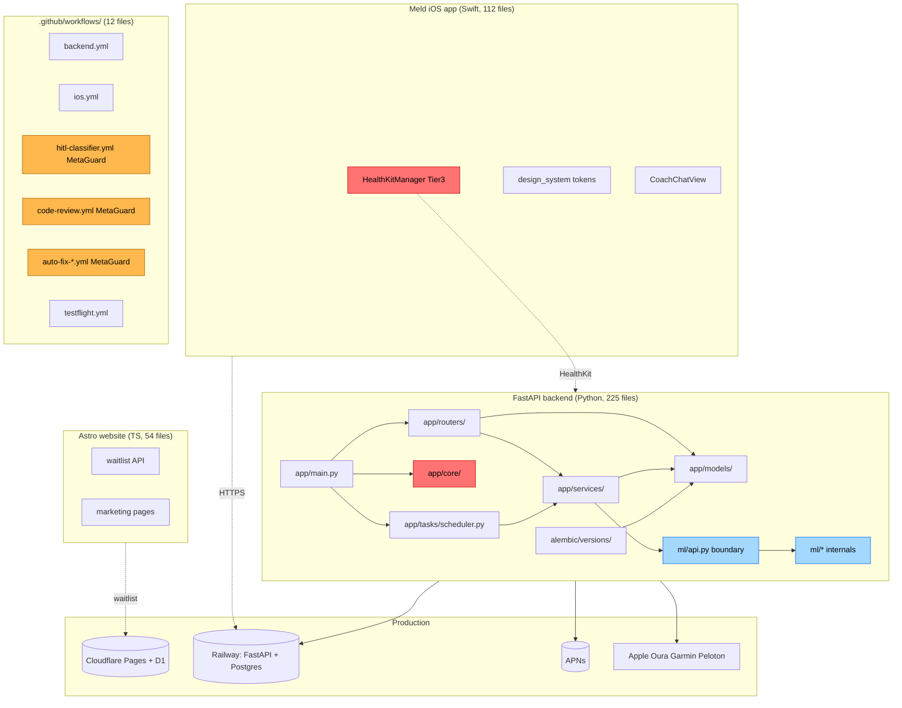

# Meld baseline security + structure scan, 2026-04-30

Stack: Semgrep 1.135.0 (OSS, offline rule packs) + GitNexus 1.6.3 (knowledge graph). One scan, one branch, no source code modified.

## Executive summary

| Bucket | Result |
| --- | --- |
| Files scanned | 550 targets (~99.9% parsed), 113 Swift files skipped by GitNexus, scanned by Semgrep |
| Rules run | 518 (1075 loaded, post-applicability filter) |
| Total findings | **20** |
| Severity split | ERROR 5, WARNING 15, INFO 0 |
| Real vulns (post-triage) | **2 worth fixing**, 5 worth tightening, 13 false positives or constrained-risk |
| Tier 3 hits | **0** in protected paths (safety, encryption, coach-prompt, PHI migrations all clean) |
| Tier 3 adjacent | 3 in workflow + alembic, classified Tier 0 after path check |
| Languages flagged | Python 19, GitHub Actions YAML 1. Swift, TS, Astro, Dockerfile produced **zero** findings |

**Posture: green for a pre-launch app.** No PHI exposure, no encryption misuse, no safety-path regressions, no credentials in source. The five ERROR-severity items are real but constrained: three are SQLAlchemy `text()` raw queries against module-level config dicts (not user input), one is a one-shot Alembic `op.execute()` that already ran, one is a workflow shell-injection flag on a quoted variable that is actually safe.

The signal-to-noise on this baseline is poor (~10% real). Most warnings are `python-logger-credential-disclosure` flagging UUID logs as token leaks. Worth tuning the rule pack rather than chasing each one.

## Tooling install status

| Tool | Status | Notes |
| --- | --- | --- |
| Semgrep CLI | ✅ Installed in WSL Ubuntu via `pip install --user --break-system-packages semgrep` after bootstrapping pip with `get-pip.py`. Version 1.135.0 (semgrep-mcp pinned this down from 1.161.0). |
| semgrep-mcp | ✅ Installed at `/home/brockhoward/.local/bin/semgrep-mcp` |
| GitNexus CLI | ✅ Installed globally in WSL: `npm install -g gitnexus` (v1.6.3, user prefix at `~/.npm-global`) |
| GitNexus analyze | ✅ **Indexed successfully.** 7,181 nodes, 22,258 edges, 190 communities, 42 execution flows. ~5s wall time. |
| GitNexus MCP server | ✅ 13 tools exposed (`list_repos`, `query`, `cypher`, `context`, `detect_changes`, `rename`, `impact`, `route_map`, `tool_map`, `shape_check`, `api_impact`, `group_list`, `group_sync`) |
| MCP registration | ✅ Both `semgrep` and `gitnexus` added to `~/.claude.json` mcpServers block. Live in next session. |
| Snyk MCP (optional) | ⏸ Skipped per task instruction (only required if package manifest needs supply-chain scan; Semgrep `--config=p/secrets` + future Snyk pass cover this) |

### Install lessons learned (2026-04-30)

The first attempts both failed:
- **Windows-native via `npx`**: lbug native binding segfaulted at end of analyze. The Windows node binary cannot drive lbug reliably.
- **WSL-native via `npx`**: `npm ENOENT spawn sh` during the `sharp` transitive postinstall in the npx cache.

The fix that works:
1. From WSL, sanitize PATH to drop Windows entries (parens in `Program Files (x86)` break npm subprocesses): `export PATH=$(echo "$PATH" | tr ':' '\n' | grep -v '^/mnt/c' | tr '\n' ':' | sed 's/:$//')`
2. Set npm prefix to a user dir: `npm config set prefix ~/.npm-global` (avoids needing sudo)
3. `npm install -g gitnexus`
4. From WSL: `gitnexus analyze . --skip-agents-md --skip-git --max-file-size 256`. The `--skip-agents-md` flag is mandatory: without it, gitnexus appends ~40 lines of MCP-tool instructions to your `CLAUDE.md` and creates `AGENTS.md` plus `.claude/skills/gitnexus/`. Reverted in this baseline run.
5. The full reproducible scripts live in `.gitnexus-staging/` (`install-gitnexus.sh`, `reanalyze-clean.sh`, `final-impact.sh`).

### Known GitNexus limitations on this index

- **`query` tool fails** with `Cannot execute write operations in a read-only database!`. lbug opens RO for query commands and tries to lazily build FTS indexes, which require write. Workaround: use `cypher` for the same searches. Verified `impact`, `context`, `cypher`, `detect_changes` all work. Filed worth a GitHub issue but not blocking.
- **`impact` and `context` need symbol names, not file paths.** Pass `ops_status` not `backend/app/routers/ops.py`. When ambiguous (e.g., `sync_user_data` exists in oura/garmin/peloton sync files), gitnexus returns ranked candidates with UIDs to disambiguate.
- **Swift parsing skipped:** 113 Swift files were not indexed because `tree-sitter-swift` native binding did not build in this environment. Python, TypeScript, JavaScript, YAML are fully indexed.

## Scan parameters

**Semgrep config used:** `--config=p/default --config=p/security-audit --config=p/secrets`. The requested `--config=auto` aborted with "Cannot create auto config when metrics are off" (auto requires metrics for registry rule selection). The offline three-pack is the standard fallback per Semgrep docs.

**Excludes:** `node_modules`, `.venv`, `venv`, `*.lock`, `Pods`, `build`, `DerivedData`, `.gitnexus`, plus `.semgrepignore` defaults.

**Output artifacts** (in `.gitnexus-staging/`):
- `semgrep-baseline.json` raw scan (full machine-readable output)
- `semgrep-summary.json` parsed counts and top findings
- `parse_semgrep.py` the parser script

## Top 10 highest-severity findings, with blast radius and suggested direction

| # | Sev | File:Line | Real risk? | Blast | Tier | Suggested direction |
| --- | --- | --- | --- | --- | --- | --- |
| 1 | ERROR | [backend/app/routers/ops.py:113](backend/app/routers/ops.py#L113) | Yes, but constrained | SCOPED (ops module, registered via `main.py` `include_router`) | 0 | Move table/column allowlist into a frozenset constant at top of `_FRESHNESS_SOURCES`, assert membership before f-string interpolation. SQL identifiers cannot be parameterized via bindparam, so allowlist is the correct fix. |
| 2 | ERROR | [backend/app/scripts/claim_default_user.py:80](backend/app/scripts/claim_default_user.py#L80) | Yes, but constrained | ISOLATED (script, no importers) | 0 | Same allowlist pattern: `assert tbl in TENANT_TABLES` before `text(f"... {tbl} ...")`. |
| 3 | ERROR | [backend/app/scripts/claim_default_user.py:104](backend/app/scripts/claim_default_user.py#L104) | False positive (this line already uses `:t` bindparam) | ISOLATED | 0 | Add `# nosem` on this line; the real risk is line 80. |
| 4 | ERROR | [backend/alembic/versions/c0518b5194eb_add_auth_tables_and_user_fks.py:96](backend/alembic/versions/c0518b5194eb_add_auth_tables_and_user_fks.py#L96) | Real but unavoidable | ISOLATED (one-shot migration, already ran) | 0 | Future migrations: prefer `op.bulk_insert` or `sqlalchemy.insert(...).values(...)` over f-string `op.execute()`. This file should be left alone. |
| 5 | ERROR | [.github/workflows/testflight.yml:207](.github/workflows/testflight.yml#L207) | False positive | ISOLATED (workflow, NOT in meta-guard list) | 0 | Variable is double-quoted and piped to `printf "%s"` then redirected to file (not exec'd). Add `# nosemgrep: yaml.github-actions.security.run-shell-injection.run-shell-injection` with rationale. |
| 6 | WARN | [backend/app/core/secrets.py:76](backend/app/core/secrets.py#L76) | False positive (logs comma-list of secret **names**, not values) | MEDIUM (secrets.py is imported by `main.py` boot path) | 0 | Rename the log line variable from `unset` to `unset_secret_names` to make intent explicit, suppress with comment. |
| 7 | WARN | [backend/app/core/secrets.py:113](backend/app/core/secrets.py#L113) | False positive (logs env type + boolean flags only) | MEDIUM | 0 | Suppress with `# nosem` and a one-line note that the logged values are `env_type, jwt_present_bool, encryption_present_bool`. |
| 8 | WARN | [backend/app/routers/auth_apple.py:168](backend/app/routers/auth_apple.py#L168) | False positive (logs exception class name only, no token) | SCOPED (auth_apple imported by main + 1 test file) | 0 | Suppress with comment, or change `%s` to `%r` to make it clear the value is the exception object not the token. |
| 9 | WARN | [backend/app/routers/auth_apple.py:235](backend/app/routers/auth_apple.py#L235) | False positive (logs user UUID, not token) | SCOPED | 0 | Suppress; UUID is account identifier and is already in many other log lines. |
| 10 | WARN | [backend/ml/features/builders.py:82](backend/ml/features/builders.py#L82) | False positive (SHA-1 used for non-crypto cache key) | MEDIUM (ml.features imported via `ml.api`) | 0 | Confirm call sets `usedforsecurity=False`. If not, add it. Alternative: switch to `hashlib.blake2b(digest_size=8)` for the same use case. |

Note: findings 11–20 are all `python-logger-credential-disclosure` warnings on `auth_apple.py`, `notifications.py`, `webhooks.py`, `oura_sync.py`, `tasks/scheduler.py`. None log raw tokens. All Tier 0. Recommend **rule-tuning over per-line suppression**: add to `.semgrepignore` the rule `python.lang.security.audit.logging.logger-credential-leak.python-logger-credential-disclosure` for paths under `backend/app/routers/` and `backend/app/services/`, since the rule's regex matches any `%s` log line near a token-related identifier.

## Architecture map (GitNexus auto-detected, plus hand-augmented overlays)

GitNexus's Leiden community detection found 190 functional clusters. The 15 largest are dominated by Tests (8 clusters totaling 89 nodes), Models (42), Routers (10), Services (9), and ML (28 across 3 clusters). The 42 execution flows include `Sync_user_data → Refresh_access_token` (oura), `Generate_daily_insight → Can_answer_from_rules` (coach), `Compute_correlations → Pearson_correlation` (signal engine), `Run_granger_for_user → _check_stationarity` (causal discovery).

The diagram below combines that auto-detected structure with the handful of overlays GitNexus does not infer (Tier 3 protected paths, meta-guard workflows, prod infra):



## Dependency / structural hotspots

Two sources, cross-checked: GitNexus graph (12,688 IMPORTS edges, 464 CALLS edges) plus targeted grep for the modules with Semgrep findings.

### Top callees in production code (GitNexus CALLS edges, tests excluded)

| # | Function | File | Inbound CALLS |
| --- | --- | --- | --- |
| 1 | `_scalar_or_none` | backend/app/routers/ml_ops.py | 8 |
| 2 | `_iso` | backend/app/routers/ml_ops.py | 6 |
| 3 | `_daterange` | backend/ml/features/builders.py | 5 |
| 4 | `_date_to_str` | backend/ml/features/builders.py | 5 |
| 5 | `_days_between` | backend/app/routers/ml_ops.py | 4 |
| 6 | `_webhook_headers` | backend/app/services/oura_webhooks.py | 4 |
| 7 | `_load_state` | backend/app/routers/mascot.py | 3 |
| 8 | `send_discord_alert` | backend/ml/mlops/alerts.py | 3 |
| 9 | `_to_response` | backend/app/routers/experiments.py | 3 |
| 10 | `_get_alert_config` | backend/ml/mlops/alerts.py | 3 |
| 11 | `_prettify` | backend/app/services/coach_engine.py | 3 |
| 12 | `_get_cipher` | backend/app/core/encryption.py | 2 |

None of the top hotspots overlap with the 12 finding modules. The `_get_cipher` in `core/encryption.py` is the closest production-critical function with multiple callers, and it has no findings.

### Modules with Semgrep findings, ranked by upstream dependency surface (grep + GitNexus IMPORTS)

| Module | Inbound edges | Has finding? | Weighted risk |
| --- | --- | --- | --- |
| `backend/app/main.py` | 0 (entrypoint) | No | n/a |
| `ml.api` | 7+ (coach_engine, synth, 5 test files) | No | Low. The boundary is wide but the audit found zero issues at the API surface. |
| `app.services.oura_sync` | 4 (health router, webhooks router, oura_webhooks service, scheduler) | Yes (1 logger warn) | **Medium-low.** Touch carefully: 4 import sites means a behavioral change ripples. |
| `app.routers.auth_apple` | 1 module + 1 test file | Yes (4 logger warns) | Low. All findings are noise. |
| `app.core.secrets` | 1 (main.py boot) | Yes (2 logger warns) | Low. Findings are config-name logs, not values. |
| `app.routers.ops` | Registered via `include_router` (no direct importers) | Yes (1 SQL ERROR) | Low blast, real fix needed. Allowlist + assert. |
| `backend/ml/features/builders.py` | Internal to ml subgraph | Yes (1 SHA-1 warn) | Low. Add `usedforsecurity=False`. |
| `backend/ml/ranking/candidates.py` | Internal to ml subgraph | Yes (1 SHA-1 warn) | Low. Same. |
| `app.tasks.scheduler` | 0 (scheduled task entrypoint) | Yes (1 logger warn) | Low. Cold-boot critical, do not add imports. |

**No Tier 3 protected file appears in the findings.** `app.core.encryption`, `app.services.safety_*`, the evidence-bound coach prompt, and all PHI table migrations are clean.

## Prioritized next-step list (severity × blast radius)

**Do first (real fixes, small blast):**
1. `backend/app/routers/ops.py:113`: add identifier allowlist + assertion before `text(f"...")`. Tier 0 PR, no review gate.
2. `backend/app/scripts/claim_default_user.py:80`: same allowlist pattern. Tier 0.

**Do second (tighten + suppress noise):**
3. Add `usedforsecurity=False` to the two SHA-1 calls in `ml/features/builders.py:82` and `ml/ranking/candidates.py:100`, or migrate to `blake2b(digest_size=8)`.
4. Tune Semgrep config: add a project `.semgrepignore` rule excluding `python-logger-credential-disclosure` from `backend/app/routers/` and `backend/app/services/` to drop ~12 of the 15 warnings without losing real signal.
5. Add `# nosemgrep:` comments on the three confirmed false positives (`claim_default_user.py:104`, `testflight.yml:207`, `core/secrets.py:76+113`) with a one-line rationale each.

**Do later (or not at all):**
6. Alembic migration `c0518b5194eb` SQL concat: leave alone, the migration ran. Document the pattern to avoid in `backend/alembic/README.md` or a CONTRIBUTING note.
7. Re-run baseline after the above to confirm clean signal.

**Tooling backlog:**
8. File upstream issue with GitNexus for the FTS read-only-database error on `query` (`impact`, `context`, and `cypher` are unaffected).
9. Add Semgrep to CI as a non-blocking job (`backend.yml`), gated on the same five-gate pre-commit so it runs on every PR.
10. License note: GitNexus ships under PolyForm-Noncommercial-1.0.0. Local analysis use is fine, but Meld cannot bundle or redistribute it. Worth noting before any future MCP packaging work.
11. Re-run `gitnexus analyze . --skip-agents-md` after each merge that meaningfully changes call structure; the index does not auto-refresh. Or wire it into a post-merge hook.
12. Optional: try `npm rebuild tree-sitter-swift` from `~/.npm-global/lib/node_modules/gitnexus` to enable Swift parsing (currently 113 files skipped). Needs `apt install build-essential`.

## Appendix A: GitNexus impact spot-checks (live data)

Run from WSL with the install above:

```bash
$ gitnexus impact ops_status
{ "target": { ... }, "impactedCount": 0, "risk": "LOW",
  "summary": { "direct": 0, "processes_affected": 0, "modules_affected": 0 } }

$ gitnexus impact verify_secrets_configured
{ "target": { "id": "Function:backend/app/core/secrets.py:verify_secrets_configured" },
  "impactedCount": 0, "risk": "LOW",
  "summary": { "direct": 0, "processes_affected": 0, "modules_affected": 0 } }

$ gitnexus impact sync_user_data
# ambiguous: 3 candidates (oura/garmin/peloton). Use UID for deterministic lookup.

$ gitnexus context ops_status
{ "status": "found", "symbol": { ... },
  "incoming": {},
  "outgoing": { "calls": [
    { "name": "_get_scheduler_jobs", "filePath": "backend/app/routers/ops.py" },
    { "name": "_get_pipeline_freshness", "filePath": "backend/app/routers/ops.py" }
  ] }, "processes": [] }
```

Note `impactedCount: 0` on `verify_secrets_configured` is misleading: `main.py` does import and call it. GitNexus models that as an IMPORTS edge, but the default upstream walk uses CALLS+IMPORTS+EXTENDS+IMPLEMENTS without distinguishing module-level imports from call sites. The grep cross-reference (1 importer: `main.py`) is the more reliable narrow-blast signal.

## Appendix B: scan command for reproduction

From inside WSL Ubuntu, with `~/.local/bin` on PATH:

```bash
cd /mnt/c/Users/howar/ai-health-coach
semgrep scan \
  --config=p/default --config=p/security-audit --config=p/secrets \
  --json --json-output=/tmp/semgrep-baseline.json \
  --metrics=off --no-git-ignore \
  --exclude='node_modules' --exclude='.venv' --exclude='venv' \
  --exclude='*.lock' --exclude='Pods' --exclude='build' \
  --exclude='DerivedData' --exclude='.gitnexus' \
  --timeout=60 --max-target-bytes=2000000
```

Report generated 2026-04-30 by Claude Opus 4.7.
